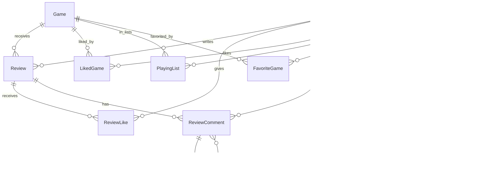

# Analyse projet Transcendance / Game Rev

Date d'analyse : 2026-07-03  
Branche creee : `ufalzone`  
Base de branche : `origin/dev`  
Commit de depart observe : `1b08ab3` (`fix: correction OAuth Google...`)

## Objectif du document

Ce document resume l'etat du projet avant implementation des websockets. Il sert de carte technique pour comprendre :

- l'architecture actuelle apps/front/back/infra ;
- les langages, frameworks et dependances ;
- les tables et jointures existantes ;
- les routes API et flux d'authentification ;
- un plan d'implementation pour un systeme de chat temps reel entre utilisateurs.

Pour l'instant, aucun code applicatif websocket/chat n'a ete ajoute.

## Vue globale

Le projet est une application web de reseau social autour des jeux video, appelee Game Rev dans le front. Les utilisateurs peuvent :

- creer un compte ou se connecter avec email/mot de passe ;
- se connecter via Google OAuth ;
- consulter des jeux video provenant de la base locale et d'IGDB ;
- liker des jeux ;
- gerer une liste de jeux en cours ;
- gerer jusqu'a 4 jeux favoris ;
- publier, modifier et supprimer des reviews ;
- liker/disliker et commenter des reviews ;
- suivre d'autres utilisateurs ;
- consulter l'activite des personnes suivies.

L'application tourne via Docker Compose avec :

- un front React/Vite servi par Nginx ;
- un backend Node.js/Express ;
- une base PostgreSQL ;
- un reverse proxy Nginx en entree ;
- Prometheus et Grafana pour le monitoring ;
- des exporters Postgres et Nginx.

## Structure des dossiers

```text
.
├── apps/backend/
│   ├── Dockerfile
│   ├── package.json
│   ├── prisma/
│   │   ├── schema.prisma
│   │   ├── seed.js
│   │   └── migrations/
│   └── src/
│       ├── config/passport.js
│       ├── index.js
│       ├── init/initPrisma.js
│       ├── middleware/auth.js
│       ├── routes/auth.js
│       ├── routes/games.js
│       ├── routes/user.js
│       └── services/igdb.js
├── apps/front/
│   ├── Dockerfile
│   ├── nginx.conf
│   ├── package.json
│   ├── vite.config.js
│   ├── public/
│   └── src/
│       ├── App.jsx
│       ├── main.jsx
│       ├── i18n.js
│       ├── components/
│       ├── pages/
│       ├── styles/
│       └── locales/
├── monitoring/
│   ├── grafana/
│   └── prometheus/
├── infra/nginx/nginx.conf
├── notes/
├── scripts/generate_certs.sh
├── infra/docker-compose.yaml
├── docker-compose.override.yaml
└── Makefile
```

## Langages et technologies

| Zone | Langage / format | Frameworks / outils |
| --- | --- | --- |
| Backend | JavaScript ESM | Node.js 20, Express 5, Prisma 7, Passport, JWT, bcrypt |
| Frontend | JavaScript JSX | React 19, React Router 7, Vite 8, i18next, react-icons |
| Base de donnees | SQL / Prisma schema | PostgreSQL 18, Prisma ORM |
| Infrastructure | YAML, Nginx conf, shell | Docker Compose, Nginx, Prometheus, Grafana |
| Styles | CSS | CSS classique par page/composant |

Dependances importantes deja presentes :

- `backend`: `express`, `@prisma/client`, `@prisma/adapter-pg`, `pg`, `jsonwebtoken`, `passport`, `passport-google-oauth20`, `bcrypt`, `cors`, `express-session`, `axios`.
- `front`: `react`, `react-dom`, `react-router-dom`, `axios`, `i18next`, `react-i18next`, `react-icons`, `socket.io-client`.

Observation importante : `socket.io-client` est deja installe cote front, mais `socket.io` n'est pas encore installe cote backend.

## Demarrage et infrastructure

### Docker Compose

`infra/docker-compose.yaml` definit les services :

- `frontend`: build du dossier `front`, expose en interne sur le reseau Docker.
- `backend`: build du dossier `backend`, lit `.env`, depend de `postgres`.
- `postgres`: image `postgres:18.4-alpine`, volume persistant `postgre-data`.
- `nginx`: entree publique en `8080:80` et `8443:443`, reverse proxy vers apps/front/back.
- `prometheus`: port `9090`.
- `grafana`: dashboard via `/grafana/`, port local expose en override.
- `postgres-exporter`: metriques PostgreSQL.
- `nginx-exporter`: metriques Nginx.

`docker-compose.override.yaml` ajoute en dev :

- volume live pour `backend`;
- port `4000:4000` pour le backend ;
- port `5433:5432` pour Postgres ;
- port `3000:3000` pour Grafana.

### Nginx principal

`infra/nginx/nginx.conf` contient :

- HTTP `80` redirige vers HTTPS `8443` ;
- HTTPS `443` sert :
  - `/api/` vers `backend:4000` ;
  - `/` vers `frontend:80` ;
  - `/grafana/` vers Grafana.

Point a prevoir pour websocket : ajouter un bloc `location /socket.io/` avec les headers d'upgrade :

- `proxy_http_version 1.1`;
- `proxy_set_header Upgrade $http_upgrade`;
- `proxy_set_header Connection "upgrade"`;
- `proxy_set_header Host $host`;
- `proxy_pass http://backend:4000`.

Sans cela, le websocket peut fonctionner en local direct sur `4000`, mais casser derriere le reverse proxy HTTPS.

### Makefile

Cibles principales :

- `make up`: cree les certificats si absents puis lance Compose ;
- `make down`;
- `make re`;
- `make logs`;
- `make ps`;
- `make clean`: supprime les volumes, donc efface la DB ;
- `make fclean`: supprime aussi images/reseaux orphelins.

## Backend

### Point d'entree

Fichier : `apps/backend/src/index.js`

Responsabilites :

- charge `.env`;
- configure Express, CORS, JSON body limit, session Passport ;
- lance `npx prisma db push` au demarrage ;
- si la DB ne contient pas de jeux, lance `npx prisma db seed` ;
- connecte Prisma ;
- monte les routers :
  - `/api/games`;
  - `/api/auth`;
  - `/api/user`;
- expose une ancienne route de test `/api/login`.

Point technique : `app.listen(PORT)` est actuellement utilise directement. Pour Socket.IO, il faudra remplacer ce lancement par un serveur HTTP :

```js
const server = http.createServer(app)
const io = new Server(server, ...)
server.listen(PORT, ...)
```

### Prisma

Fichier : `apps/backend/src/init/initPrisma.js`

Le client Prisma utilise :

- `@prisma/client`;
- `@prisma/adapter-pg`;
- `pg.Pool`;
- variables `DB_HOST`, `DB_USER`, `DB_PASS`, `DB_NAME`, `DB_PORT`.

### Authentification

Fichiers :

- `apps/backend/src/routes/auth.js`
- `apps/backend/src/middlewares/auth.js`
- `apps/backend/src/config/passport.js`

Flux existants :

- inscription : `POST /api/auth/register`;
- connexion : `POST /api/auth/login`;
- Google OAuth :
  - `GET /api/auth/google`;
  - `GET /api/auth/google/callback`.

Le JWT contient :

```js
{ id: user.id, username: user.username }
```

Expiration : 7 jours.

Le front stocke :

- `localStorage.token`;
- `localStorage.user`.

Pour le websocket, le handshake peut reutiliser ce JWT via :

```js
io("...", { auth: { token } })
```

puis verifier le token cote serveur avec `jwt.verify`, comme dans `authMiddleware`.

### Routes jeux

Fichier : `apps/backend/src/routes/games.js`

Routes principales :

| Methode | Route | Role |
| --- | --- | --- |
| GET | `/api/games/new-releases` | Jeux recents depuis DB |
| GET | `/api/games/highly-praised` | Jeux les mieux notes |
| GET | `/api/games/popular` | Jeux tries par nombre de reviews |
| GET | `/api/games/coming-soon` | Jeux a venir DB puis IGDB |
| GET | `/api/games/search?q=` | Recherche DB puis IGDB |
| GET | `/api/games/all` | Tous les jeux DB |
| GET | `/api/games/category/:name` | Filtre par genre/theme/mode |
| GET | `/api/games/recent-acclaimed` | Jeux recents bien notes |
| GET | `/api/games/:id` | Detail jeu + reviews |

### Routes utilisateur/social

Fichier : `apps/backend/src/routes/user.js`

Routes principales :

| Methode | Route | Role |
| --- | --- | --- |
| PUT | `/api/user/avatar` | Modifier avatar |
| GET | `/api/user/me` | Infos utilisateur connecte |
| POST | `/api/user/like/:gameId` | Toggle like jeu |
| GET | `/api/user/liked` | Jeux likes |
| POST | `/api/user/playing/:gameId` | Toggle playing list |
| GET | `/api/user/playing` | Playing list |
| GET | `/api/user/favorites` | Favoris |
| POST | `/api/user/favorites/:gameId` | Ajouter favori |
| DELETE | `/api/user/favorites/:gameId` | Supprimer favori |
| GET | `/api/user/status/:gameId` | Statut like/playing |
| PUT | `/api/user/username` | Modifier username |
| PUT | `/api/user/password` | Modifier password |
| DELETE | `/api/user/delete` | Supprimer compte |
| GET | `/api/user/search?q=` | Rechercher utilisateurs |
| POST | `/api/user/friend-request/:userId` | Suivre un utilisateur |
| GET | `/api/user/following` | Abonnements |
| GET | `/api/user/followers` | Abonnes |
| GET | `/api/user/profile/:userId` | Profil public |
| GET | `/api/user/friends-activity` | Activite des suivis |
| DELETE | `/api/user/follow/:userId` | Ne plus suivre |
| DELETE | `/api/user/follower/:userId` | Retirer un abonne |
| POST | `/api/user/review` | Creer review |
| GET | `/api/user/reviews` | Reviews de l'utilisateur |
| GET | `/api/user/reviews/all` | Reviews des autres |
| GET | `/api/user/reviews/following` | Reviews des suivis |
| PUT | `/api/user/review/:reviewId` | Modifier review |
| DELETE | `/api/user/review/:reviewId` | Supprimer review |
| POST | `/api/user/review/:reviewId/like` | Like/dislike review |
| GET | `/api/user/review/:reviewId/likes` | Compteurs like/dislike |
| POST | `/api/user/review/:reviewId/comment` | Commenter review |
| GET | `/api/user/review/:reviewId/comments` | Lire commentaires |
| DELETE | `/api/user/comment/:commentId` | Supprimer commentaire |
| GET | `/api/user/activity/:userId` | Activite publique utilisateur |

Note : `SettingsPage.jsx` appelle aussi `/api/apikey`, mais aucune route `/api/apikey` n'est montee dans `apps/backend/src/index.js`. Il faudra verifier si cette fonctionnalite est incomplete ou dans une autre branche.

## Frontend

### Routing

Fichier : `apps/front/src/App.jsx`

Routes React :

| Route | Page |
| --- | --- |
| `/` | LoginPage |
| `/home` | HomePage |
| `/games` | GamesPage |
| `/post` | PostPage |
| `/reviews` | ReviewsPage |
| `/profile` | ProfilePage |
| `/profile/:userId` | OtherProfilePage |
| `/settings` | SettingsPage |
| `/game/:id` | GamePresentationPage |
| `/friends` | FriendsPage |
| `/privacy` | PrivacyPolicyPage |
| `/terms` | TermsOfServicePage |

### Auth front

Fichier : `apps/front/src/components/InscriptionForm.jsx`

- `axios.post('/api/auth/login')`
- `axios.post('/api/auth/register')`
- stockage local :
  - `localStorage.setItem('token', token)`;
  - `localStorage.setItem('user', JSON.stringify(user))`.

Fichier : `apps/front/src/pages/HomePage.jsx`

- lit le token/user depuis l'URL apres callback Google ;
- stocke dans `localStorage`.

### Navigation

Les navbars sont separees par zone (`HomeNavBar`, `GamesNavBar`, `FriendsNavBar`, etc.). Le lien social principal actuel est `/friends`. Pour le chat, deux integrations sont possibles :

1. ajouter une route dediee `/chat` ou `/messages` ;
2. ajouter un panneau conversation directement dans `/friends`.

Recommandation : commencer avec une route dediee `/chat`, puis ajouter des boutons "message" depuis `FriendsList`, `OtherProfilePage` et la recherche utilisateur.

### Internationalisation

Fichiers :

- `apps/front/src/i18n.js`;
- `apps/front/src/locales/en.json`;
- `apps/front/src/locales/fr.json`;
- `apps/front/src/locales/es.json`.

Toute UI chat devra ajouter les cles dans les trois fichiers.

## Base de donnees actuelle

Fichier : `apps/backend/prisma/schema.prisma`

### Modeles

- `login_test`: table de test ancienne.
- `Users`: utilisateurs.
- `ApiKey`: cle API liee a un utilisateur.
- `Game`: jeux video.
- `Review`: review d'un jeu par un utilisateur.
- `ReviewLike`: like/dislike sur une review.
- `ReviewComment`: commentaires et reponses sur reviews.
- `LikedGame`: jeux likes par utilisateur.
- `PlayingList`: jeux en cours par utilisateur.
- `Friendship`: relation de follow/friend entre utilisateurs.
- `FavoriteGame`: favoris avec position.

### Jointures et relations

| Relation | Type | Table / modele | Cle |
| --- | --- | --- | --- |
| `Users` -> `Review` | 1-N | `reviews` | `Review.userId` |
| `Game` -> `Review` | 1-N | `reviews` | `Review.gameId` |
| `Users` -> `ReviewLike` | 1-N | `review_likes` | `ReviewLike.userId` |
| `Review` -> `ReviewLike` | 1-N | `review_likes` | `ReviewLike.reviewId` |
| `Users` <-> `Game` likes | N-N explicite | `liked_games` | `(userId, gameId)` |
| `Users` <-> `Game` playing | N-N explicite | `playing_list` | `(userId, gameId)` |
| `Users` <-> `Game` favoris | N-N explicite + position | `favorite_games` | `(userId, gameId)` et unique `(userId, position)` |
| `Users` <-> `Users` follow | N-N reflexive | `friendships` | `(userId1, userId2)` |
| `Review` -> `ReviewComment` | 1-N | `review_comments` | `ReviewComment.reviewId` |
| `Users` -> `ReviewComment` | 1-N | `review_comments` | `ReviewComment.userId` |
| `ReviewComment` -> `ReviewComment` | 1-N reflexive | `review_comments.parentId` | commentaires/reponses |
| `Users` -> `ApiKey` | 1-1 | `api_key` | `ApiKey.userId unique` |

### Diagramme relationnel simplifie



## Observations et risques avant websocket

1. `socket.io-client` existe deja cote front, mais il manque `socket.io` cote backend.
2. Le backend utilise `app.listen`; Socket.IO demande un serveur HTTP partage.
3. Nginx ne gere pas encore explicitement les upgrades websocket.
4. Les tokens sont en `localStorage`; le websocket devra les lire et les envoyer au handshake.
5. Les secrets presents dans `.env.example` semblent reels (`JWT_SECRET`, Twitch, Google). Il faudra les regenerer/rotater et ne garder que des placeholders dans l'exemple.
6. Le backend lance `prisma db push` automatiquement au demarrage. C'est pratique en dev, mais risque en prod si les migrations chat deviennent sensibles.
7. Le modele `Friendship` fonctionne comme un follow unidirectionnel, meme si le nom dit friendship. Pour le chat, il faut decider si les messages sont autorises :
   - vers n'importe quel utilisateur ;
   - seulement vers les personnes suivies ;
   - seulement si follow reciproque ;
   - avec blocage futur.
8. La table `Friendship.status` a `pending`, `accepted`, `blocked`, mais la route actuelle cree directement `accepted`.
9. Les generated Prisma files dans `apps/backend/generated/prisma` semblent partiels/stales par rapport au schema actuel ; le code utilise `@prisma/client`, donc ce dossier n'est probablement pas la source active.
10. Il n'y a pas encore de tests automatises utiles (`backend` a un script test placeholder).

## Plan d'implementation websocket + chat

### Decision technique recommandee

Utiliser Socket.IO pour rester coherent avec la dependance front deja installee (`socket.io-client`). Socket.IO apporte :

- authentification handshake simple ;
- rooms par utilisateur/conversation ;
- fallback transport ;
- reconnexion client ;
- emissions ciblees ;
- meilleure ergonomie que le module `ws` brut pour ce projet.

### Fonctionnalites v1 proposees

Pour une premiere version solide :

- conversations 1-to-1 entre utilisateurs ;
- creation automatique d'une conversation au premier message ;
- liste des conversations triees par dernier message ;
- historique pagine des messages ;
- envoi temps reel ;
- reception temps reel si le destinataire est connecte ;
- indicateur online/offline simple ;
- compteur non lu ;
- marquage lu ;
- suppression logique ou edition a garder pour v2.

### Politique d'autorisation a choisir

Recommandation pour v1 : autoriser le chat si l'une de ces conditions est vraie :

- utilisateur A suit B ;
- utilisateur B suit A ;
- ou follow reciproque si vous voulez reduire le spam.

La version la plus propre socialement : follow reciproque obligatoire.  
La version la plus simple avec le produit actuel : un utilisateur peut envoyer un message aux personnes qu'il suit.

Le choix doit etre applique partout :

- route de creation conversation ;
- event websocket `message:send`;
- acces historique ;
- liste conversations.

## Schema Prisma propose

Ajouter trois modeles :

```prisma
model Conversation {
  id          Int      @id @default(autoincrement())
  type        String   @default("direct") @db.VarChar(20)
  createdAt   DateTime @default(now()) @map("created_at")
  updatedAt   DateTime @updatedAt @map("updated_at")

  participants ConversationParticipant[]
  messages     ChatMessage[]

  @@map("conversations")
}

model ConversationParticipant {
  conversationId Int      @map("conversation_id")
  userId         Int      @map("user_id")
  joinedAt       DateTime @default(now()) @map("joined_at")
  lastReadAt     DateTime? @map("last_read_at")

  conversation Conversation @relation(fields: [conversationId], references: [id], onDelete: Cascade)
  user         Users        @relation(fields: [userId], references: [id], onDelete: Cascade)

  @@id([conversationId, userId])
  @@index([userId])
  @@map("conversation_participants")
}

model ChatMessage {
  id             Int      @id @default(autoincrement())
  conversationId Int      @map("conversation_id")
  senderId       Int      @map("sender_id")
  body           String   @db.Text
  createdAt      DateTime @default(now()) @map("created_at")
  editedAt       DateTime? @map("edited_at")
  deletedAt      DateTime? @map("deleted_at")

  conversation Conversation @relation(fields: [conversationId], references: [id], onDelete: Cascade)
  sender       Users        @relation(fields: [senderId], references: [id], onDelete: Cascade)

  @@index([conversationId, createdAt])
  @@index([senderId])
  @@map("chat_messages")
}
```

Il faudra aussi ajouter dans `Users` :

```prisma
conversationParticipants ConversationParticipant[]
sentMessages ChatMessage[]
```

Note Prisma : si plusieurs relations pointent vers `Users`, nommer explicitement la relation `@relation("ChatMessageSender")` peut etre necessaire pour eviter l'ambiguite.

### Variante avec conversation directe unique

Pour garantir une seule conversation entre deux utilisateurs, deux strategies :

1. Ajouter `directKey String? @unique`, valeur du type `minUserId:maxUserId`.
2. Ou verifier applicativement les participants avant creation.

Recommandation : `directKey`, car simple et robuste.

Exemple :

```prisma
directKey String? @unique @map("direct_key")
```

Pour A=12 et B=5 : `directKey = "5:12"`.

## API REST chat proposee

Les REST endpoints servent pour chargement initial, pagination et fallback. Le temps reel passe par Socket.IO.

| Methode | Route | Role |
| --- | --- | --- |
| GET | `/api/chat/conversations` | Liste conversations de l'utilisateur |
| POST | `/api/chat/conversations/direct/:userId` | Cree/recupere une conversation directe |
| GET | `/api/chat/conversations/:id/messages?cursor=&limit=` | Historique pagine |
| POST | `/api/chat/conversations/:id/read` | Marque comme lu |

Un nouveau fichier serait coherent :

```text
apps/backend/src/routes/chat.js
```

Puis dans `apps/backend/src/index.js` :

```js
import chatRouter from './routes/chat.js'
app.use('/api/chat', chatRouter)
```

## Socket.IO backend propose

Nouveaux fichiers possibles :

```text
apps/backend/src/socket/index.js
apps/backend/src/socket/authSocket.js
apps/backend/src/socket/chatSocket.js
```

### Auth handshake

Pseudo-flux :

1. Le client envoie `auth.token`.
2. Le serveur verifie JWT avec `process.env.JWT_SECRET`.
3. Le serveur attache `socket.user = { id, username }`.
4. Le socket rejoint :
   - `user:${userId}` pour les notifications globales ;
   - les rooms `conversation:${conversationId}` accessibles.

### Events v1

| Event client -> serveur | Payload | Role |
| --- | --- | --- |
| `conversation:join` | `{ conversationId }` | Rejoindre une conversation autorisee |
| `conversation:leave` | `{ conversationId }` | Quitter une room |
| `message:send` | `{ conversationId, body, clientId }` | Envoyer un message |
| `message:read` | `{ conversationId }` | Marquer lu |
| `typing:start` | `{ conversationId }` | Indiquer saisie |
| `typing:stop` | `{ conversationId }` | Stop saisie |

| Event serveur -> client | Payload | Role |
| --- | --- | --- |
| `message:new` | message complet | Nouveau message |
| `message:sent` | `{ clientId, message }` | Ack expediteur |
| `conversation:updated` | conversation summary | Reordonner liste |
| `message:read` | `{ conversationId, userId, lastReadAt }` | Etat lu |
| `typing:start` | `{ conversationId, userId }` | Saisie |
| `typing:stop` | `{ conversationId, userId }` | Stop saisie |
| `presence:update` | `{ userId, online }` | Presence |
| `error` | `{ code, message }` | Erreur lisible |

### Validation serveur

Chaque event doit verifier :

- socket authentifie ;
- conversation existe ;
- utilisateur participant ;
- body non vide ;
- body taille max, par exemple 2000 caracteres ;
- rate limit simple par socket pour eviter spam ;
- escape/affichage texte brut cote front, pas de HTML injecte.

## Frontend chat propose

### Nouveaux fichiers

```text
apps/front/src/services/socket.js
apps/front/src/services/chatApi.js
apps/front/src/pages/ChatPage.jsx
apps/front/src/components/chat/ConversationList.jsx
apps/front/src/components/chat/ChatWindow.jsx
apps/front/src/components/chat/MessageBubble.jsx
apps/front/src/components/chat/MessageComposer.jsx
apps/front/src/components/chat/TypingIndicator.jsx
apps/front/src/styles/ChatPage.css
```

### Integration routing

Dans `apps/front/src/App.jsx` :

```jsx
<Route path="/chat" element={<ChatPage />} />
<Route path="/chat/:conversationId" element={<ChatPage />} />
```

Dans les navbars :

- ajouter un lien `Messages` / `Chat` ;
- ou ajouter une icone message a cote des amis.

Dans `FriendsList` et `OtherProfilePage` :

- bouton "Message" ;
- appel `POST /api/chat/conversations/direct/:userId` ;
- navigation vers `/chat/:conversationId`.

### Gestion socket front

`apps/front/src/services/socket.js` :

- cree une instance singleton Socket.IO ;
- lit `localStorage.token`;
- connecte seulement si token present ;
- expose `connectSocket`, `disconnectSocket`, `getSocket`;
- gere la reconnexion apres login/logout.

Important : au logout dans `SettingsPage`, deconnecter le socket avant de supprimer token/user.

### UI recommandee

Page `/chat` :

- colonne gauche : conversations avec avatar, username, dernier message, unread count ;
- zone droite : historique + composer ;
- mobile : liste puis conversation plein ecran ;
- etat vide : selectionner une conversation ;
- etat offline/reconnexion visible mais discret.

Le style doit rester coherent avec Game Rev :

- fond existant via `Background` ;
- typographies existantes ;
- boutons avec `react-icons` ;
- pas de grosse landing page.

## Etapes d'implementation recommandees

### Phase 1 - Preparation

1. Installer `socket.io` dans `apps/backend/package.json`.
2. Ajouter les modeles Prisma `Conversation`, `ConversationParticipant`, `ChatMessage`.
3. Ajouter les relations manquantes dans `Users`.
4. Generer Prisma.
5. Remplacer `app.listen` par `http.createServer(app)` dans `apps/backend/src/index.js`.
6. Configurer Socket.IO avec CORS adapte.

### Phase 2 - REST chat

1. Creer `apps/backend/src/routes/chat.js`.
2. Implementer `GET /api/chat/conversations`.
3. Implementer `POST /api/chat/conversations/direct/:userId`.
4. Implementer `GET /api/chat/conversations/:id/messages`.
5. Implementer `POST /api/chat/conversations/:id/read`.
6. Ajouter des helpers d'autorisation :
   - `canMessageUser(currentUserId, targetUserId)`;
   - `assertConversationParticipant(conversationId, userId)`.

### Phase 3 - Socket backend

1. Creer middleware Socket.IO d'auth JWT.
2. Joindre automatiquement `user:${id}`.
3. Implementer `conversation:join`.
4. Implementer `message:send` avec persistence Prisma.
5. Emettre `message:new` aux participants.
6. Emettre `conversation:updated` pour mettre a jour les listes.
7. Ajouter `message:read`.
8. Ajouter `typing:start/stop`.
9. Ajouter presence online/offline en memoire.

### Phase 4 - Nginx / Docker

1. Ajouter `location /socket.io/` dans `infra/nginx/nginx.conf`.
2. Verifier le proxy HTTPS `https://localhost:8443`.
3. Verifier le mode dev direct `localhost:4000` si necessaire.
4. S'assurer que le front utilise la meme origine en prod (`/socket.io`) pour eviter CORS.

### Phase 5 - Front

1. Creer `apps/front/src/services/socket.js`.
2. Creer `apps/front/src/services/chatApi.js`.
3. Ajouter `ChatPage`.
4. Ajouter composants :
   - `ConversationList`;
   - `ChatWindow`;
   - `MessageBubble`;
   - `MessageComposer`.
5. Brancher events Socket.IO.
6. Ajouter route `/chat`.
7. Ajouter bouton message depuis amis/profils.
8. Ajouter traductions `en`, `fr`, `es`.

### Phase 6 - Qualite / tests

Tests manuels minimum :

1. Deux comptes connectes dans deux navigateurs.
2. A suit B, puis A envoie un message a B.
3. B recoit en temps reel sans refresh.
4. B refresh : l'historique est toujours la.
5. A voit son message confirme.
6. B marque lu, A recoit l'info.
7. Utilisateur non participant tente d'acceder a une conversation : refus 403.
8. Token invalide websocket : connexion refusee.
9. Nginx HTTPS : websocket connecte via `https://localhost:8443`.
10. Logout : socket deconnecte et ne recoit plus de messages.

Tests automatisables plus tard :

- helpers d'autorisation chat ;
- creation conversation directe unique ;
- pagination messages ;
- handshake JWT ;
- envoi message refuse si non participant.

## Ordre de travail conseille

Ordre le plus sur :

1. schema Prisma + REST chat ;
2. Socket.IO backend ;
3. proxy Nginx ;
4. page front minimale ;
5. integration UX dans friends/profils ;
6. presence, typing, unread count ;
7. durcissement securite/tests.

Cela permet de valider la persistence avant le temps reel. Le websocket devient alors une couche de synchronisation, pas le seul chemin fonctionnel.

## Definition de done pour la v1 chat

La v1 peut etre consideree terminee quand :

- un utilisateur connecte peut ouvrir `/chat`;
- il voit ses conversations ;
- il peut demarrer une conversation depuis un profil ou la page amis ;
- il peut envoyer un message ;
- l'autre utilisateur le recoit instantanement ;
- l'historique est conserve en base ;
- les conversations sont protegees par JWT et participation ;
- le websocket fonctionne derriere Nginx HTTPS ;
- le logout coupe la connexion socket ;
- aucun message HTML/script n'est rendu comme HTML.

